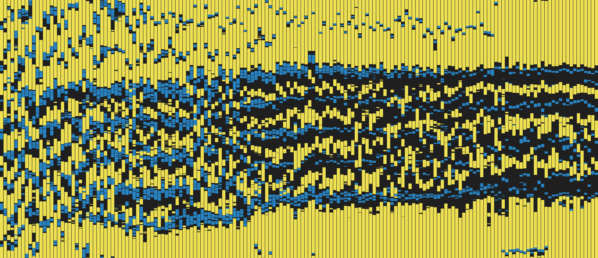

# Feed Baby Timeline Generator

This script will take a CSV export from the [Feed Baby app](http://feedbaby.com.au/), and reconstruct the timeline as one big image.



Print it on a poster! Put it on a t-shirt! Or print it out and give it to your child when they're older so you can show them just how much of a pain they were.

## Usage

Take the CSV exports from Feed Baby and put them into a sub-directory called `data`. Then run the `generate_timeline.php` script.

```
>ls data
excretions.csv
feeds.csv
sleeps.csv
...

>php generate_timeline.php
Loading data from exported files...
Creating timeline image...
timeline.png written, processing complete

>
```

You will then have a file called `timeline.png` in the directory.

## Customization

There are some customization options at the top of the script, which let you control if various labels and marking lines show up, and where you can configure the colours. I've not massively tested them, so things may break if you play about with them too much. They should all be well explained in the code comments.
